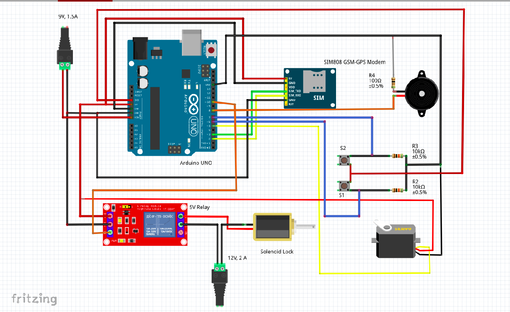

feel safe Technologies is an OTP based smart locker system
using GSM module and an android app

Any one of project_test_x_x.c files are to be uploaded to an arduino board(UNO Preferred),
after the phone number is edited.
The circuit is made as in given diagram. Insert the sim card in GSM module, and turn on 
the circuit. If the button is pressed we can see the message being sent and the messages 
that are recieved via GSM module in the serial monitor of Arduino IDE.

